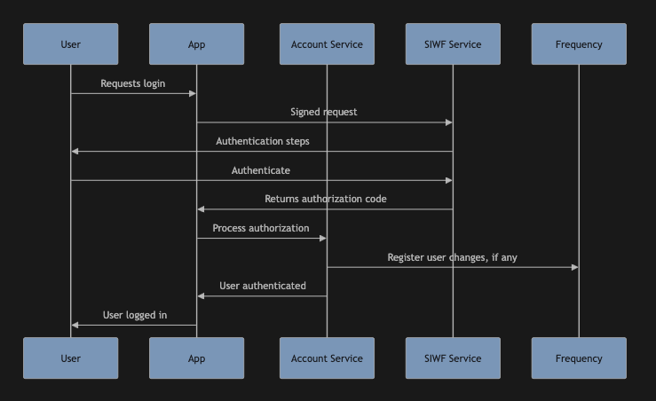

# SIWF v2 Reference Implementation Proposal

## Context and Scope
Sign-In with Frequency v2 (SIWF v2) is an authentication mechanism for the Frequency network that needs clear implementation guidance and testing tools for developers. We need to provide comprehensive resources for developers to implement it correctly. The reference implementation will serve as both documentation and a practical example of SIWF v2 usage.

## Goals
1. Provide a complete, working reference implementation of SIWF v2 that demonstrates:
   - All possible payload types and their construction
   - Integration with multiple wallet types (MetaMask, Polkadot.js wallet)
   - Proper signature generation (secp256k1 via EIP-712, sr25519 via SCALE)
   - Authorization flow implementation

2. Create a development environment that allows:
   - Easy testing of a SIWF v2 implementation
   - Verification of payload construction
   - Usage with the Social App Template (SAT)

## Proposal

#### 1. Core SIWF v2 Implementation
- HTTP Client: Create a way to handle all outgoing http requests using Axios
- Account Service Client: Build a controller that interfaces with a Gateway Acccount Service
- Payload Builder: Handles construction of all SIWF v2 payload types
- Signature Manager: Manages signature creation and verification
- Wallet Connector: Provides unified interface for different wallet types (Polkadot wallets, and Metamask)
   
#### 2. Developer Interface
- Web UI for payload construction and testing (React or Svelte)
- API endpoints for access to SIWF v2 functionality
- Integration examples with Social App Template

#### 3. Education
- Create new and update existing documentation (SIWF documentation could use some TLC)
- Provide a flow charts explaining the handshakes along the lines of below:

### Implementation Details

#### Documentation and Education highlights
- SIWF use cases and importance
- How wallets replace username and passwords to verify user identity
- Provides proof of account ownership without exposing private keys
- What're cryptographic signatures and how they work

#### Payload Builder
- Implements all SIWF v2 payload types
- Provides type-safe interfaces for payload construction
- Validates payload structure before signing

#### Wallet Integration
##### MetaMask/EVM Wallets
- Implements EIP-1193 for window.ethereum
- Handles EIP-712 typed data signing
- Future support for EIP-6963

##### Polkadot Wallets
- Integration with Talisman and SubWallet
- SCALE encoding for sr25519 signatures
- Proper handling of different address formats

### Gateway Integration

#### API Integration
- Direct payload submission to Gateway endpoints
- Pre-submission validation
- Response management and error handling
- Prerequisite validation (MsaID existence, delegations?, provider status?)

#### Validation Flow
1. Payload validation
2. Actual Gateway submission
3. Response processing and error handling